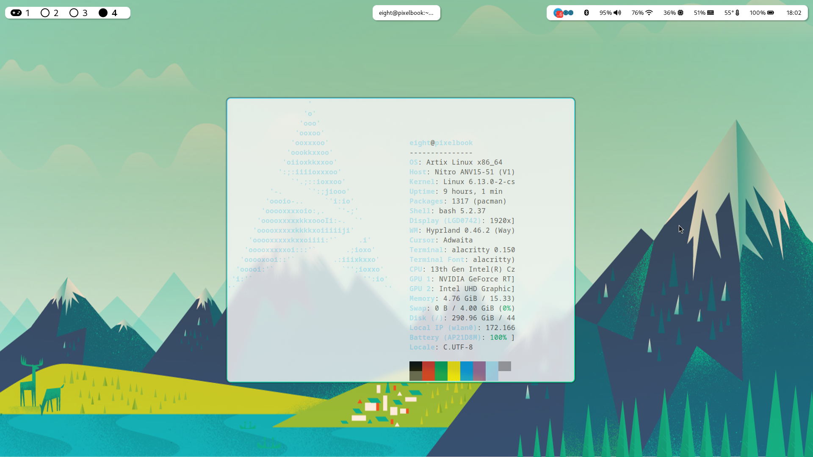

# Field of my rice 🌾

<section style="text-align: center;">

_(This is what would look like)_
</section>

## Config
Default is for Arch Linux and derivatives distro, so check out `config.sh` and edit it as you like
## Install
If you trust me just execute `installer.sh`, or check the scripts.
